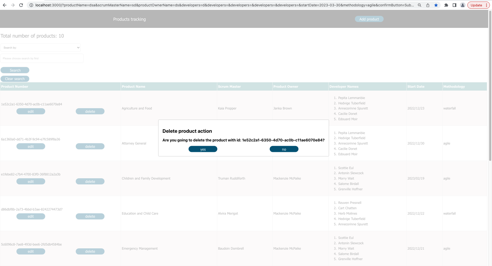
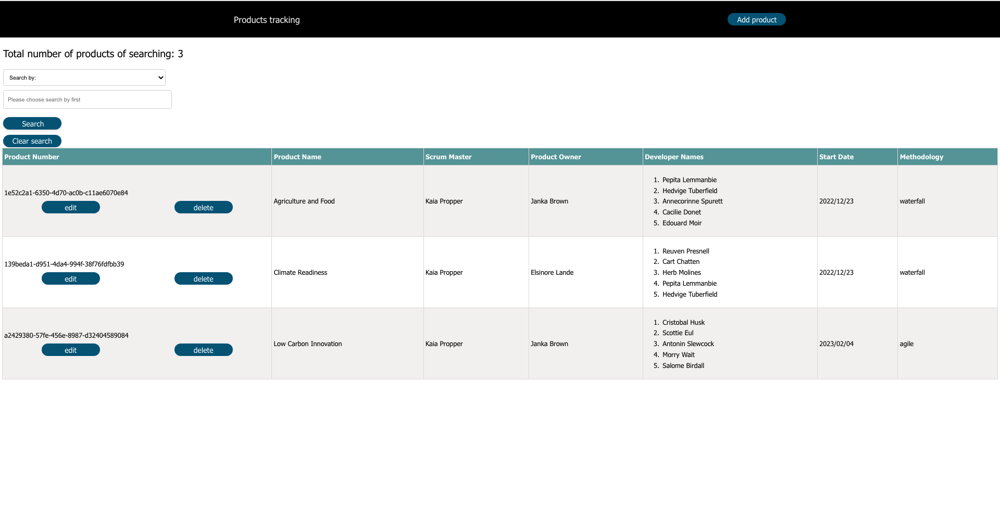
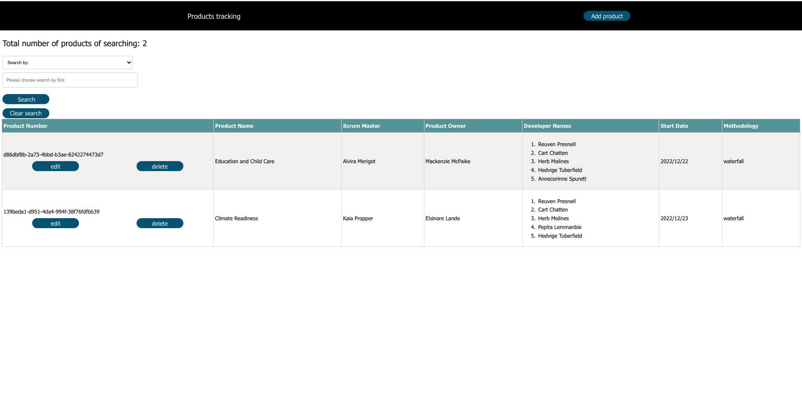

# CAN-LE-IS24-full-stack-competition-req97073

Thank you very much for your time to review my assigment.

You also can see it on this address: https://github.com/canle2021/CAN-LE-IS24-full-stack-competition-req97073

For saving your time, this is the video demo: https://youtu.be/BVokuWvAyoc
At the limited time, I just put this video for now. I will fix it later.

## Note:

1. I used APIs with port of 8001. Because the ReactJs uses port of 3000 as default, I would like to avoid this confliction if I used port 8001 for all APIs of the server.

So, all the APIs will be http://localhost:8001/api/

## Initial setup

1. Evething is in the main branch on GitHub.
2. I used nodeJS for backend, ReactJS for frontend, json file for data in the folder "data"
3. I used nodeJS: v19.2.0
4. I used yarn version 1.22.19 to add dependencies
5. I used Macbook pro M1 to create this project.
6. I used Google Chome to renders front end and Insomnia to for backend testing
7. Role of main folders: client: front end, server: back end, data: data storage, instructions: all instructions.
8. Set up:

- After clone my repo, from main branch, redirect to client and server as picture:
  
- use: "yarn install" for both to install all dependencies. I recommend using yarn for no extra node_modules created or any more files. You can use "npm install" instead of yarn, but yarn is for the best performance.
  
- use: "yarn start" for both client and server for starting the project, and you can see the result as image:
  

## What I finished:

1. GitHub Repository Component, only main branch left for the repo.
2. Backend API Component: in server folder with all CRUD actions, RESTful APIs
3. Frontend Component: User Story 1 2 and 3
4. Bonus: User Story 4 and 5
5. Extra tools: delete product, eidit and delete with fast update in searching mode.

## What I will finish if I have more time:

1. API Swagger Documentation.

## Some images about my app

